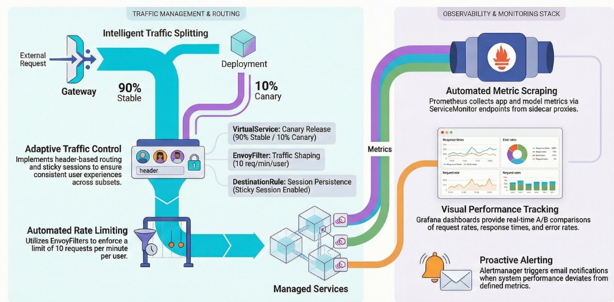

# Deployment Documentation

This document explains the final deployment at an abstract level and is split
by assignment phase (A1-A4). It focuses on entities, connections, and request
flow, and avoids low-level YAML details. Links are provided when exact config
matters.

## A1: Versioned containerized deployment (Docker Compose)

### Deployment structure
A1 deploys two containers in a single Docker Compose network and relies on a
shared library during the app build:

- **app**: Spring Boot UI, exposed to the host at `APP_PORT` (default 8080).
- **model-service**: Python REST API, exposed to the host at `MODEL_PORT`
  (default 8081).
- **lib-version**: Maven library used by the app at build time to align
  versioning across releases (no runtime container).
- **shared model volume**: host path `./model` mounted into the model-service
  container at `/app/output` to hold model artifacts.

The app container depends on the model-service and calls it through the Compose
network using the service name `model-service`.

References:
- `operation/docker-compose.yml`
- `operation/README.md`
- `app/README.md`
- `lib-version/README.md`

### Request/data flow
1. A user opens the UI at `http://localhost:8080/sms`.
2. The app container forwards classification to
   `http://model-service:8081/predict` using the Compose service DNS
   (internal network name, not reachable directly from the host).
3. The model-service loads the model from `/app/output` and returns a prediction.
4. The app returns the result to the user.

There is no dynamic routing in A1 (all traffic is direct).
Inside the Compose network the DNS name is `model-service`, while the host
accesses the same service via `http://localhost:8081`.

### Access points
- UI: `http://localhost:8080/sms`
- Model API: `http://localhost:8081/predict`

### How to run (A1)
From the `operation` repo root:

```bash
cd operation
docker compose up --pull always
```


Then you can go to `http://localhost:8080/sms` and test out prediction.


Optional variables (via `.env`):
- `APP_PORT`, `MODEL_PORT`, `APP_IMAGE`, `MODEL_IMAGE`

### Visualization


## A2: Kubernetes cluster provisioning

(TODO) Describe the abstract cluster setup and core components introduced in A2.

## A3: Helm-based deployment and monitoring

(TODO) Describe Helm release structure, Prometheus/Grafana integration, and
service-level relations.

## A4: Istio traffic management and experimentation

### Deployment structure

A4 introduces Istio service mesh for traffic management, enabling canary releases
with consistent routing and sticky sessions. The deployment builds on A3 by adding
Istio traffic management resources and extends monitoring with experiment-specific
Grafana dashboards.

#### Deployed Resources

**Application Layer (4 Deployments, 5 Services)**

| Resource | Type | Purpose |
|----------|------|---------|
| `app-stable` | Deployment | Stable version of the web application (90% traffic) |
| `app-canary` | Deployment | Canary version for experimentation (10% traffic) |
| `model-service-stable` | Deployment | ML model service for stable app |
| `model-service-canary` | Deployment | ML model service for canary app |
| `app` | Service | Main service endpoint for the application |
| `model-service` | Service | Generic model service (not used in A4) |
| `model-service-stable` | Service | Routes only to stable model pods |
| `model-service-canary` | Service | Routes only to canary model pods |

**Istio Traffic Management (4 Resources)**

| Resource | Type | Purpose |
|----------|------|---------|
| Istio Ingress Gateway | Pod (istio-system) | Entry point for external traffic, receives requests at `192.168.56.91:80`. Provisioned during cluster setup, not part of Helm chart. |
| `app-gateway` | Gateway | Accepts HTTP traffic for host `sms-istio.local` on port 80 and routes into the mesh |
| `app-vs` | VirtualService | Implements 90/10 traffic split and header-based canary routing |
| `app-destinationrule` | DestinationRule | Defines stable/canary subsets with sticky session configuration |
| `rate-limit-filter` | EnvoyFilter | Implements per-user rate limiting (additional use case) |

**Monitoring Stack** (Prometheus, Grafana, ServiceMonitors, Alertmanager)

**Configuration** (ConfigMaps for app settings, Secrets for credentials)

#### Consistent Routing (Old→Old, New→New)

A critical requirement is ensuring version consistency between app and model-service.
This is achieved through **dedicated Kubernetes Services** with version-specific selectors:

```
app-stable deployment                    model-service-stable deployment
  ENV: MODEL_HOST=model-service-stable ──────► selector: version=stable
  
app-canary deployment                    model-service-canary deployment  
  ENV: MODEL_HOST=model-service-canary ──────► selector: version=canary
```

The `MODEL_HOST` environment variable in each app deployment is hardcoded to call
the matching model service, guaranteeing routing at deployment time.

#### Ingress Gateway Configuration

The Istio Ingress Gateway is provisioned during cluster setup with label
`istio: ingressgateway`. The Helm chart makes this configurable via
`istio.ingressGateway.selector` in values.yaml for different clusters.

### Request/data flow

1. User accesses `http://sms-istio.local/sms/` (requires `/etc/hosts` entry: `192.168.56.91 sms-istio.local`)
2. **Istio Ingress Gateway** → **Gateway** → **VirtualService** (90/10 split or header-based routing)
3. **DestinationRule** applies sticky session via `sms-session` cookie (TTL: 1 hour)
4. **EnvoyFilter** checks rate limit (10 req/min per user, returns 429 if exceeded)
5. Request reaches `app-stable` or `app-canary` pod
6. App calls matching model service (`model-service-stable` or `model-service-canary`)
7. Model returns prediction, app renders result to user
8. **Prometheus** scrapes metrics, **Grafana** displays experiment dashboards

### Dynamic routing decisions

| Decision Point | Component | Configuration Location |
|----------------|-----------|------------------------|
| 90/10 traffic split | VirtualService (`app-vs`) | `istio.canary.weight` in values.yaml |
| Sticky sessions | DestinationRule (`app-destinationrule`) | `istio.stickySession.enabled` in values.yaml |
| Force canary (testing) | VirtualService (`app-vs`) | Header `x-canary: true` |
| Rate limiting | EnvoyFilter (`rate-limit-filter`) | `istio.rateLimiting` in values.yaml |
| App→Model routing | Kubernetes Service DNS | `MODEL_HOST` env var in app-deployment.yaml |

**Where is the 90/10 split configured?** In `values.yaml` under `istio.canary.weight`.

**Where is the routing decision taken?** The Envoy proxy in the Istio Ingress Gateway
evaluates VirtualService rules and reads the `sms-session` cookie for sticky sessions.

### Additional Use Case: Rate Limiting

Per-user rate limiting using an EnvoyFilter with local rate limit configuration.
Users (by IP) are allowed 10 requests per minute; exceeding returns HTTP 429.
Configured via `istio.rateLimiting` in values.yaml (burst size, tokens per refill,
fill interval). The EnvoyFilter injects this into the Ingress Gateway's HTTP filter chain.

### Access points

| Endpoint | URL/Command | Headers/Notes |
|----------|-------------|---------------|
| App (via Istio) | `http://sms-istio.local/sms/` | Requires `/etc/hosts`: `192.168.56.91 sms-istio.local` |
| Force canary | `curl -H "x-canary: true" http://sms-istio.local/sms/` | Always routes to canary version |
| Grafana | `kubectl port-forward svc/myprom-grafana 3000:80` | Credentials: admin/prom-operator |
| Prometheus | `kubectl port-forward svc/myprom-kube-prometheus-prometheus 9090:9090` | |
| App metrics | `http://sms-istio.local/actuator/prometheus` | Exposed via ServiceMonitor |

### Visualization




### Continuous Experimentation Support

The deployment supports A/B testing between stable and canary versions:

1. **Traffic Split**: VirtualService routes 90% to stable, 10% to canary
2. **Consistent Routing**: Each app version calls its matching model service
3. **Sticky Sessions**: Users stay on their assigned version for the session duration
4. **Metrics Collection**: Both versions expose identical Prometheus metrics
5. **Dashboard Comparison**: Grafana dashboards visualize metrics side-by-side

The experiment details (hypothesis, metrics, decision process) are documented in
`docs/continuous-experimentation.md`.

