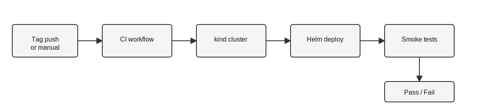

# Extension Proposal: CI-Triggered Helm Release Pipeline

## Shortcoming in current release practice
Releases are not promoted through a single, automated pipeline. The Helm chart
in `operation/` uses fixed image tags in `values.yaml`, and deployments are
mostly manual (operators run Helm commands and validate by hand). This creates
a release gap between:

- Image build/publish (app/model-service repos) and
- Cluster deployment and smoke validation (operation repo).

Why this is problematic:
- App and model-service tags can drift, leading to incompatible pairs.
- Manual validation is slow and inconsistent, so regressions can slip through.
- There is no standard evidence trail for "this release was tested and passed."

This is a release-engineering issue tied directly to assignments about
containerized releases and Helm-based deployment.

## Proposed extension
Create a CI-triggered Helm deployment pipeline in the `operation` repository.
The workflow automatically deploys the Helm chart to a temporary test cluster
(kind), runs smoke tests, and rolls back or uninstalls on failure. This
standardizes release verification and reduces manual steps.

Key behaviors:
- Triggered by `workflow_dispatch` (manual inputs) or a release tag push.
- Uses `helm upgrade --install` with explicit `app.tag` and `model.tag`.
- Runs smoke tests in-cluster (no ingress required).
- On failure: rollback/uninstall and collect logs.

This extension is genuine and not already required by the assignment rubrics:
the assignments cover image builds, Helm packaging, monitoring, and traffic
management, but do not require a release gate that automatically deploys and
verifies tags in a CI environment.

Diagram of the proposed release gate:



## Implementation plan (1-5 days)
1. Add `operation/.github/workflows/deploy-helm.yml`.
2. In the workflow:
   - Create a kind cluster.
   - Install Helm and kubectl.
   - `helm dependency update` for the chart.
   - `helm upgrade --install` with `--set app.tag` and `--set model.tag`.
   - Disable Istio/Prometheus in CI (`--set istio.enabled=false` and
     `--set prometheus.enabled=false`) to avoid missing CRDs in kind.
3. Add smoke tests:
   - `curl http://app:8080/sms/` from a temporary pod.
   - `curl -X POST http://model-service:8081/predict` with retry logic.
4. Failure handling:
   - `helm rollback` or `helm uninstall`.
   - Collect logs for app/model pods.
5. Document usage in `operation/docs/extension.md` and link to the workflow.

Release flow sketch:

```
tag push / manual trigger
        |
        v
 build images (already in app/model-service)
        |
        v
kind cluster -> helm upgrade --install -> smoke tests
        |
        +-- pass -> recorded as successful release
        +-- fail -> rollback/uninstall + logs
```

## Expected outcomes
- Faster, reproducible release verification with standard logs.
- Reduced manual mistakes in tag alignment between app and model-service.
- Measurable deployment quality (pass/fail history, rollback events).

## Generality
This pattern is applicable to any multi-service project that releases container
images and deploys via Helm. The same gate can validate version compatibility,
basic health, and rollback behavior without being tied to the SMS Checker
domain.

## How to evaluate the improvement
Define objective metrics and compare before/after over several releases:
- Lead time to deploy: time from tag push to a successful deployment.
- Change failure rate: percentage of releases that fail smoke tests.
- MTTR (time to recovery): time from a failed deploy to rollback completion.
- Verification coverage: percentage of releases with recorded smoke-test logs.

Experiment design:
- Run N releases manually (baseline) and N releases through the pipeline.
- Record the metrics above from GitHub Actions logs and Helm history.
- Compare averages and variance; improvement should be observable and
  reproducible across multiple iterations.

## Assumptions and downsides
- Assumes images are already built and pushed by app/model-service workflows.
- kind is sufficient for smoke tests but does not validate Istio/Prometheus.
- Adds CI runtime cost (cluster spin-up and deployment time).
- Requires maintenance of workflow and test scripts when APIs change.
- If the smoke tests are too shallow, some regressions can still pass.

## External sources and rationale
These sources discuss why automated, repeatable release processes improve
reliability and speed, and provide objective metrics for evaluation:

- Google SRE Book, Release Engineering chapter (discusses minimizing human
  error and increasing release repeatability):
  https://sre.google/sre-book/release-engineering/
- DORA metrics (argues for lead time, change failure rate, and MTTR as
  objective indicators of delivery performance):
  https://cloud.google.com/architecture/devops/devops-measurement-model
- "Continuous Delivery" (Humble/Farley) emphasizes automated deployment
  pipelines as a way to reduce deployment risk and enable fast feedback:
  https://continuousdelivery.com/

Tool references used for implementation details:
- Helm upgrade/rollback:
  https://helm.sh/docs/helm/helm_upgrade/
  https://helm.sh/docs/helm/helm_rollback/
- Kubernetes rollout status:
  https://kubernetes.io/docs/reference/generated/kubectl/kubectl-commands#rollout
